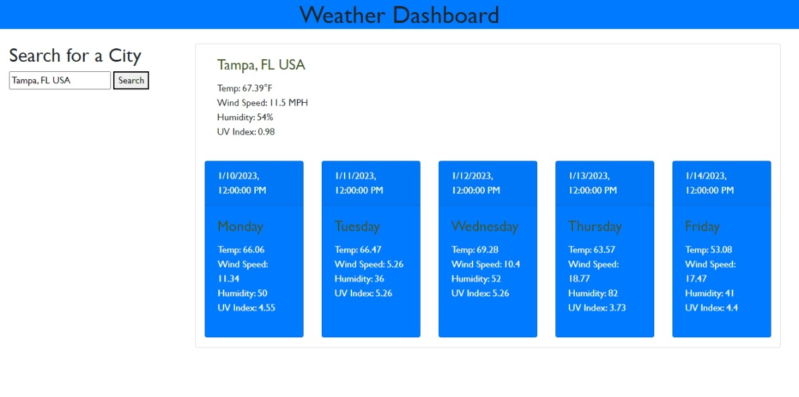

# Weather-Dasboard
Weather-Dashboard using server-side API's 

## Description
A weather-dashbaord that provides weather for any city searched for

## User Story

```
AS A traveler
I WANT to see the weather outlook for multiple cities
SO THAT I can plan a trip accordingly
```
## Acceptance Criteria

```
GIVEN a weather dashboard with form inputs
WHEN I search for a city
THEN I am presented with current and future conditions for that city and that city is added to the search history
WHEN I view current weather conditions for that city
THEN I am presented with the city name, the date, an icon representation of weather conditions, the temperature, the humidity, and the the wind speed
WHEN I view future weather conditions for that city
THEN I am presented with a 5-day forecast that displays the date, an icon representation of weather conditions, the temperature, the wind speed, and the humidity
WHEN I click on a city in the search history
THEN I am again presented with current and future conditions for that city
```

## Usage



## Installation

The project was uploaded to GitHub at the following repository:  

https://github.com/Mrose332/Weather-Dasboard.git


You can access the deployed application with the GitHub Pages link: 

 https://mrose332.github.io/Weather-Dasboard/
 

